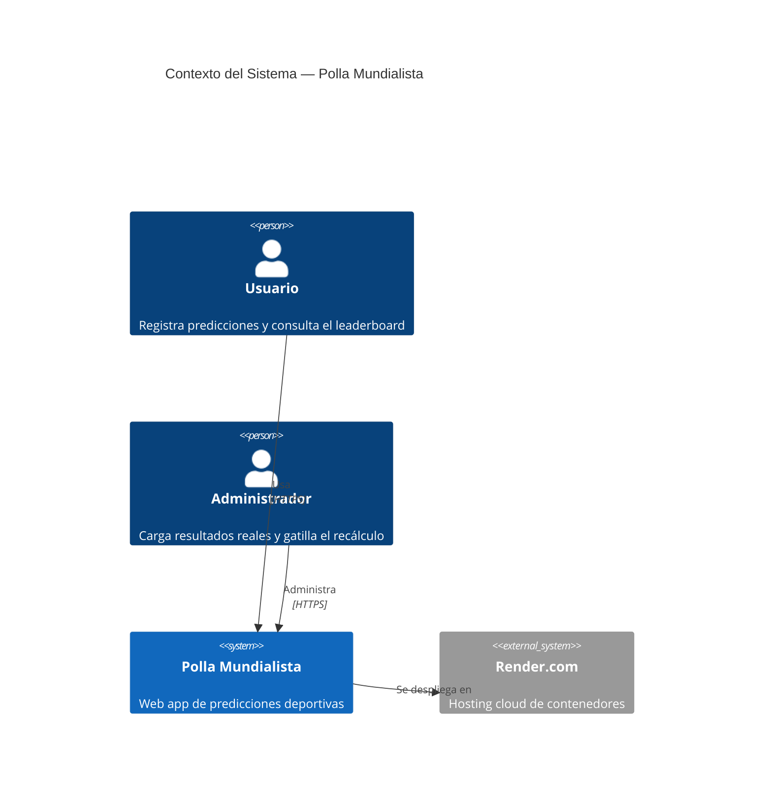
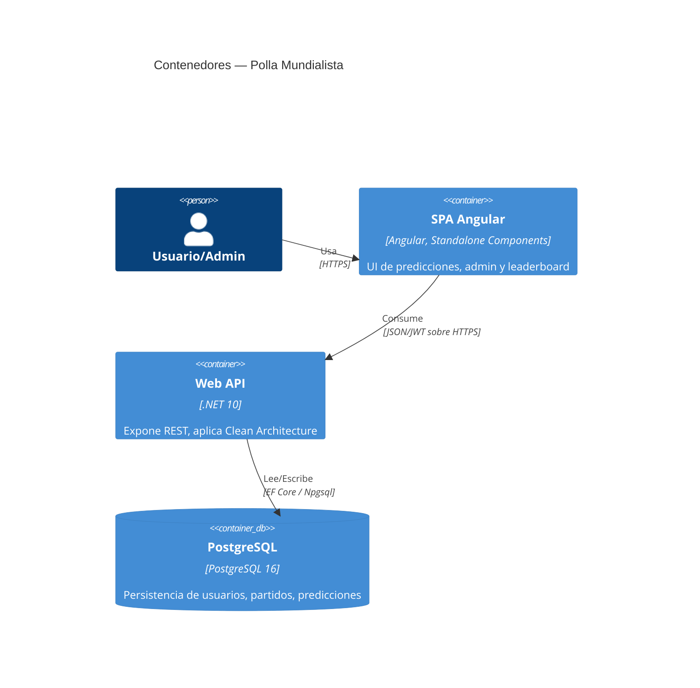
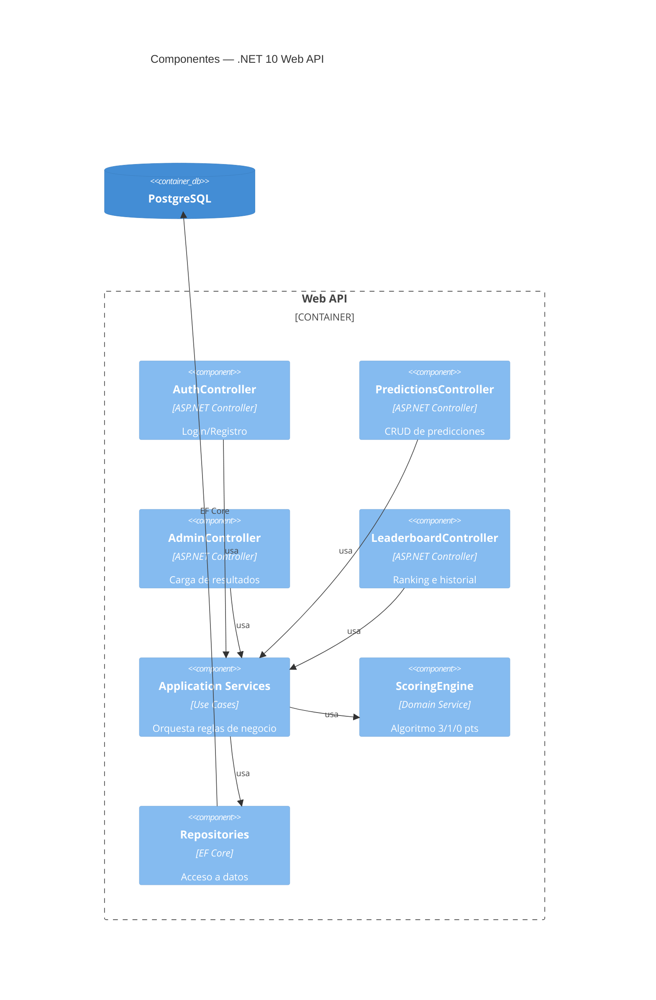
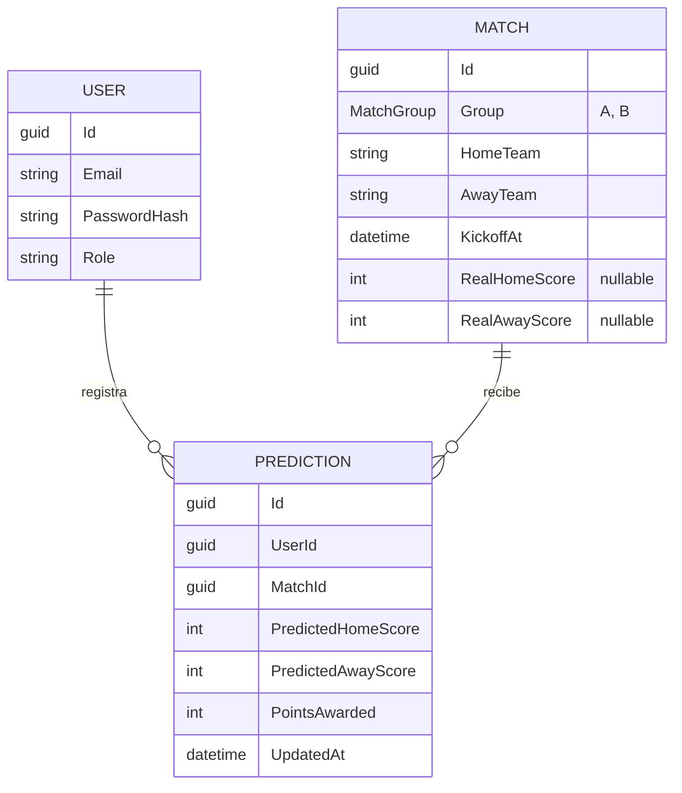

# Diseño de Arquitectura — Polla Mundialista (Bizagi)

Este documento define **cómo** se construye lo especificado en [`docs/spec.md`](./spec.md). El desglose en tareas ejecutables está en [`docs/tasks.md`](./tasks.md).

## 1. Visión Arquitectónica General

Clean Architecture en el backend con dependencias apuntando siempre hacia el Domain; Angular standalone en el frontend consumiendo la API vía HTTP/JWT; PostgreSQL como store de producción y EF Core InMemory/SQLite como store del harness de pruebas. El flujo de trabajo es AI-First y SDD: el harness (Task #1) se construye y se verifica en verde **antes** de escribir Domain/Application/Infrastructure/API de producción.

```
┌─────────────┐      JWT/HTTPS      ┌──────────────────┐      EF Core       ┌──────────────┐
│  Angular     │ ──────────────────▶ │  .NET 10 Web API  │ ─────────────────▶ │ PostgreSQL   │
│  (SPA)       │ ◀────────────────── │  Clean Architecture│ ◀───────────────── │ (Docker)     │
└─────────────┘      JSON            └──────────────────┘                    └──────────────┘
                                              │
                                              │ (test harness, no producción)
                                              ▼
                                     EF Core InMemory / SQLite
```

## 2. Modelo C4

> El diagrama final entregable (Task de cierre) se produce con estas mismas vistas en una herramienta de diagramación (Structurizr, draw.io o Mermaid exportado). Se documenta aquí en Mermaid como fuente versionada.

### 2.1 Nivel 1 — Contexto



### 2.2 Nivel 2 — Contenedores



### 2.3 Nivel 3 — Componentes (Web API)



## 3. Estructura del Repositorio (Monorepo)

```
BIZAGI/
├── .claude/                      # agentes, skills y config del harness de IA
│   ├── agents/                   # Architect, Code Reviewer, QA Harness Agent
│   └── settings.json
├── backend/
│   ├── src/
│   │   ├── PollaMundialista.Domain/
│   │   ├── PollaMundialista.Application/
│   │   ├── PollaMundialista.Infrastructure/
│   │   └── PollaMundialista.Api/
│   ├── tests/
│   │   ├── PollaMundialista.UnitTests/
│   │   └── PollaMundialista.IntegrationTests/
│   └── PollaMundialista.sln
├── frontend/
│   ├── src/app/
│   │   ├── auth/
│   │   ├── predictions/
│   │   ├── admin/
│   │   ├── leaderboard/
│   │   └── core/ (interceptors, guards, services compartidos)
│   └── angular.json
├── docs/
│   ├── spec.md
│   ├── design.md
│   ├── tasks.md
│   ├── fixtures/matches-seed.json
│   └── architecture/ (export final del diagrama C4)
├── docker-compose.yml
├── AI_LOG.md
└── README.md
```

## 4. Arquitectura Backend — Clean Architecture (4 capas)

| Proyecto | Responsabilidad | Depende de |
|---|---|---|
| `Domain` | Entidades (`Match`, `Prediction`, `User`), enum `MatchGroup` (`A`, `B`; usado por `Match.Group`), excepciones e invariantes de dominio, Value Objects (`Score`, `MatchResult`), `ScoringEngine` (algoritmo de puntuación puro, sin dependencias externas) | Nada |
| `Application` | Commands/Queries + Handlers (`RegisterPredictionCommand`/`Handler`, `SubmitResultCommand`/`Handler`, `RecalculateScoresCommand`/`Handler`, `GetLeaderboardQuery`/`Handler`), interfaces de repositorio (`IMatchRepository`, `IPredictionRepository`), DTOs, `Behaviors` de pipeline (validación, logging) | `Domain`, paquete `Mediator.SourceGenerator` |
| `Infrastructure` | `AppDbContext` (EF Core), implementaciones de repositorios, configuración de entidades (incluye `HasData` del seeder), Npgsql, hashing de contraseñas, generación de JWT | `Application`, `Domain` |
| `Api` | Controllers "delgados" (solo mapean HTTP ⇄ Command/Query y despachan vía `IMediator`), middlewares, configuración de DI, Swagger, políticas de autorización por rol | `Application`, `Infrastructure` (solo en `Program.cs` para composition root) |

**Regla de dependencia**: `Api` y `Infrastructure` conocen a `Application`/`Domain`; `Domain` no conoce a nadie. `Api` **nunca** invoca directamente una clase de `Application`: siempre pasa por `IMediator.Send(...)` (ver §4.1). Esto permite que `PollaMundialista.UnitTests` testee `ScoringEngine` y los Handlers de `Application` sin instanciar EF Core ni HTTP.

**Organización de enums (todas las capas)**: cada enum pertenece a la capa que es dueña del significado que representa: reglas de negocio en `Domain`, conceptos de casos de uso en `Application`, detalles técnicos en `Infrastructure` y contratos HTTP/presentación en `Api`. Decláralos como tipos independientes y ubícalos en una carpeta `Enums` de esa capa o junto al feature dueño del concepto; no los agrupes bajo `Entities`. El namespace debe reflejar la capa o feature. Esta organización no altera la regla de dependencias: las capas externas pueden referenciar tipos de capas internas cuando corresponda, nunca al revés. No crees enums duplicados por rutina ni un proyecto compartido para eludir esos límites; traduce tipos en el límite de adaptación solo cuando representen contratos o significados distintos.

**Invariantes del Domain**: una clase estática `DomainErrorMessages` centraliza como constantes los mensajes de error del dominio. Las violaciones de invariantes o reglas de dominio lanzan la excepción propia `DomainException`, no `ArgumentException`; constructores y métodos no escriben mensajes inline. `DomainException` y `DomainErrorMessages` pertenecen a `Domain` y no agregan dependencias externas.

`Match.Group` usa el enum explícito `MatchGroup` (`A`, `B`); las reglas del dominio trabajan con ese tipo y no validan grupos comparando strings hardcoded.

### 4.1 Comunicación API ↔ Application: Patrón Mediator

Se adopta el patrón Mediator para desacoplar los `Controllers` de la lógica de aplicación, usando el paquete **`Mediator`** (martinothamar/Mediator — source-generator based, sin reflection en runtime, a diferencia de MediatR).

- **Dónde vive**: el paquete expone nativamente `ICommand<TResponse>` / `IQuery<TResponse>`. Sus handlers NO son `IRequestHandler<TRequest, TResponse>` (esa interfaz es exclusiva de `IRequest<T>`, que `ICommand`/`IQuery` no heredan) — son `ICommandHandler<TCommand, TResponse>` e `IQueryHandler<TQuery, TResponse>` respectivamente, cada uno con `Handle(TCommand/TQuery, CancellationToken) -> ValueTask<TResponse>`. Se definen y ubican en `Application` (referencia el paquete `Mediator.SourceGenerator` vía `<PackageReference>` con `OutputItemType="Analyzer"`, como exige el source generator).
- **Registro DI**: `Application` expone un método de extensión `AddApplicationServices(this IServiceCollection services)` que llama a `services.AddMediator(options => options.ServiceLifetime = ServiceLifetime.Scoped)`; `Api.Program.cs` lo invoca en el composition root junto con `AddInfrastructureServices(...)`.
- **Flujo típico** (ej. registrar una predicción):
  1. `PredictionsController.Post(PredictionRequestDto dto)` mapea el DTO a `RegisterPredictionCommand` y llama `await _mediator.Send(command, ct)`.
  2. `RegisterPredictionCommandHandler` (en `Application`) valida la regla de bloqueo por `KickoffAt`, invoca los repositorios (`IPredictionRepository`) y retorna un `Result`/DTO de respuesta.
  3. El Controller traduce el resultado del Handler a un `IActionResult` (`200 OK`, `400 BadRequest`, `409 Conflict`).
- **Pipeline Behaviors**: se aprovecha el mismo mecanismo para cross-cutting concerns sin ensuciar los Handlers — un `ValidationBehavior<TRequest,TResponse>` (usando FluentValidation) y un `LoggingBehavior<TRequest,TResponse>` se registran como `IPipelineBehavior` globales.
- **Impacto en el Harness (Tarea #1)**: los `IntegrationTests` con `WebApplicationFactory` siguen ejercitando solo HTTP (no conocen Mediator); los `UnitTests` de Handlers instancian el Handler directamente con repositorios mockeados por Moq — **no** requieren levantar el mediador completo, solo testear el Handler como una clase más.

## 5. Arquitectura Frontend — Angular Standalone

- Sin Nx; workspace único generado con Angular CLI.
- Componentes standalone agrupados por feature (`auth/`, `predictions/`, `admin/`, `leaderboard/`), cada uno con sus propios componentes, servicios y rutas (`*.routes.ts`) cargadas vía lazy loading (`loadChildren`/`loadComponent`).
- `core/`: `AuthInterceptor` (adjunta JWT), `AuthGuard`/`RoleGuard` (protección de rutas Admin), `ApiService` base.
- Estado: RxJS + servicios con `BehaviorSubject` (sin NgRx — no se justifica por el tamaño del dominio).
- Estilos: Tailwind CSS (decisión cerrada en Tarea #10 — combina mejor con un look propio no genérico de Material) para acelerar el panel Admin y el leaderboard.

### 5.1 Lenguaje visual (tema oscuro en toda la app)

El origen de la decisión fue el refactor de la pantalla de Login, que surgió de un hueco funcional detectado al diseñarla: el enlace "¿Olvidaste tu contraseña?" sin endpoint que lo respaldara (ver §7.2). Ese refactor fijó un lenguaje visual propio, "sports & tournament dashboard", que después se extendió a las cuatro pantallas internas. El tema oscuro dejó de ser exclusivo de Auth: **hoy las 6 pantallas de la app usan el mismo sistema visual**.

- **Las 6 pantallas** (`/login`, `/register`, las futuras `/forgot-password` y `/reset-password`, más `/predictions`, `/admin`, `/leaderboard` y `/history`): tema oscuro — fondo `slate-950` con gradiente radial `emerald` y grilla decorativa, tarjetas `bg-slate-900/80` con `border-slate-800`, `rounded-2xl`, `shadow-lg shadow-black/30` y acento de marca `emerald`. Estética "sports & tournament dashboard".
- **Navbar compartido** (`core/components/navbar/`): barra `sticky` presente en las 4 pantallas internas, con logo-marca a la izquierda, navegación central (`Leaderboard`, `Mi Historial` y `Panel Admin`, este último solo para rol Admin) y sesión a la derecha (avatar con inicial, email truncado y "Cerrar sesión"). Reemplaza los encabezados por pantalla con su propio link "Volver a predicciones".
  - Se declara **dentro del template de cada pantalla** y no en `app.html`: cada pantalla conserva así su propio layout y sus tests siguen consultando sus links sobre el fixture de esa pantalla, porque el DOM de un componente hijo cae dentro del host.
  - El estado de link activo se resuelve con el output `isActiveChange` de `RouterLinkActive` elevado a signal, no con `RouterLinkActive` escribiendo en `class`: el link activo y el inactivo comparten utilidades de color y dos clases que colisionan en el mismo atributo se resuelven por orden en la hoja de estilos, no por intención. `aria-current="page"` se escribe explícitamente desde ese signal.
- **Navegación por grupos en Predicciones**: pestañas `Grupo A` / `Grupo B` (A activa por defecto) sobre un `signal<MatchGroup>` activo y un `computed()` de partidos visibles. Implementan el patrón ARIA de tabs completo (`tablist`/`tab`/`tabpanel`, `aria-selected`, `aria-controls`, `roving tabindex`, flechas ← → y Home/End).
- **Identidad de equipo**: bandera emoji por nombre de equipo (mapa en `core/models/predictions.models.ts`, matching normalizado con NFD para que "Países Bajos" y "Paises Bajos" resuelvan igual), con `aria-hidden="true"` y el nombre siempre al lado como texto. Si el equipo no está en el mapa se cae a un badge de iniciales: nunca se inventa una bandera.
- **Iconografía**: SVG inline (Lucide/Heroicons en su path, 24×24, `stroke-width="2"`, `aria-hidden="true"`). No se agrega una librería de iconos al `package.json` para un handful de iconos.
- **Tokens de interacción**: `focus:ring-2 focus:ring-emerald-500/50 focus:border-emerald-500`, `active:scale-[0.98]` en la acción primaria, y objetivo táctil mínimo de 44px en campos y botón.
- **Contraste verificado, no supuesto**: los colores compuestos se midieron sobre el render real del navegador (conversión `oklch`/`oklab` a sRGB y composición alfa contra el fondo efectivo). De ahí salieron dos correcciones que la intuición no habría detectado — el texto blanco sobre `emerald-600` da 3.65:1 y **no** cumple AA, por lo que toda acción primaria usa `bg-emerald-700` (5.03:1) — y la regla de no bajar de `text-slate-400` (6.83:1) en texto, reserving `text-slate-500` para elementos decorativos o `aria-disabled`.
- **Accesibilidad**: `<label>` visible o `aria-label` en todo campo, `autocomplete` correcto (`email` / `current-password` / `new-password`), `aria-invalid` y `aria-describedby` apuntando al mensaje de error, y el alternador de visibilidad de contraseña con `aria-pressed` y `aria-label` dinámico. Las tablas mantienen semántica nativa (`<caption class="sr-only">`, `scope="col"`) y las columnas numéricas usan `tabular-nums` para que las cifras no bailen al cambiar de valor.
- **Locale**: `registerLocaleData(localeEs)` + `LOCALE_ID: 'es'` en `app.config.ts`, para que `DatePipe` no renderice fechas en inglés en una UI en español. Formato de fecha en las cards: `d MMM y, HH:mm` (el `medium` de Angular agrega segundos de más).
- **Zoneless**: la app corre sin `zone.js`, así que mutar un view model in-place no dispara detección de cambios. Cada pantalla que guarda datos expone un `notify…Changed()` que reemplaza la referencia del array que respalda su signal. Un bug equivalente ya ocurrió una vez (el botón de submit fuera de su `<form>`, que los tests no detectan porque llaman al método del componente en vez de hacer click en el DOM) y quedó cubierto por tests de regresión que clickean el botón renderizado.

### 5.2 Copy de interfaz

El contenido estático visible al usuario pertenece a la capa de presentación Angular, no a la API, al backend ni a la configuración de entorno. Para el alcance actual de una sola variante de español, cada feature mantiene un módulo tipado e inmutable de copy (`*.copy.ts`), organizado por pantalla o componente; el componente lo importa y lo expone a su template. Las plantillas enlazan esos valores en vez de declarar literales de interfaz. El copy compartido vive en `core/` solo cuando existe reutilización real; no se crea un servicio global ni un diccionario monolítico.

El catálogo incluye títulos, instrucciones, botones, estados de carga/vacío, errores, confirmaciones y textos accesibles (`aria-label`, `title`). Los datos variables de dominio (equipos, fechas, marcadores) siguen viniendo del modelo; los mensajes que los interpolan se definen como funciones tipadas del módulo de copy. Las pruebas de componentes verifican que el copy se renderice y que las etiquetas accesibles sigan asociadas a sus controles.

Esta organización separa contenido de estructura sin introducir ahora una dependencia ni simular configuración dinámica. Si el producto requiere mantener varias locales con builds por locale, se adopta la localización nativa de Angular (`@angular/localize`) con mensajes marcados y catálogos de traducción. Si además se necesita cambiar de idioma dentro de una sesión en ejecución, se evalúa una solución con soporte explícito para traducción runtime; no se amplía el catálogo TypeScript para modelar idiomas.

## 6. Modelo de Datos



Restricción de unicidad: índice único compuesto `(UserId, MatchId)` en `Prediction` para garantizar upsert (nunca dos predicciones activas del mismo usuario para el mismo partido).

`Match.Group` es de tipo `MatchGroup`, con valores `A` y `B`; el Domain no decide la validez del grupo mediante comparaciones de strings hardcoded.

## 7. Contrato de API (endpoints principales)

> Cada fila implica: `Controller` → construye el Command/Query correspondiente → `IMediator.Send(...)` → `Handler` en `Application`. Ningún Controller contiene lógica de negocio.

| Método | Ruta | Rol | Descripción |
|---|---|---|---|
| POST | `/api/auth/register` | Público | Crea usuario con rol `User` |
| POST | `/api/auth/login` | Público | Retorna JWT |
| GET | `/api/matches` | User/Admin | Lista los 12 partidos (con resultado si existe) |
| POST | `/api/predictions` | User | Crea/actualiza (upsert) una predicción propia |
| GET | `/api/predictions/me` | User | Historial de predicciones propias |
| GET | `/api/predictions/user/{userId}` | Admin | Historial de predicciones de cualquier usuario |
| PUT | `/api/admin/matches/{matchId}/result` | Admin | Ingresa/corrige el resultado real y dispara recálculo |
| GET | `/api/leaderboard` | User/Admin | Ranking global ordenado por puntos |

**Filas planificadas** (Tarea #14, aún **no implementadas** — no forman parte del contrato vigente hasta que esa tarea cierre):

| Método | Ruta | Rol | Descripción |
|---|---|---|---|
| POST | `/api/auth/forgot-password` | Público | Solicita un token de reseteo; **siempre** responde con el mismo mensaje genérico |
| POST | `/api/auth/reset-password` | Público | Consume el token y fija la nueva contraseña |

**Criterio de orden y desempate del leaderboard** (`docs/spec.md` §6.4, definido aquí): 1) `TotalPoints` descendente; 2) a igualdad de puntos, cantidad de predicciones con marcador exacto (`PointsAwarded == 3`) descendente; 3) a igualdad de ambos, `Email` ascendente (orden alfabético), como desempate final determinístico. `LeaderboardEntryDto` expone `Email` y `ExactPredictions` además de `UserId`/`TotalPoints` para soportar este orden y mostrarlo en la UI.

### 7.1 Documentación OpenAPI/Swagger

- **Paquete**: `Swashbuckle.AspNetCore` (`AddEndpointsApiExplorer()` + `AddSwaggerGen(...)`) registrado en el composition root de `Api.Program.cs`, junto a `AddApplicationServices`/`AddInfrastructureServices`.
- **Seguridad**: dado que la API ya protege endpoints con JWT Bearer (§4.1, Tarea #5), `AddSwaggerGen` define un esquema de seguridad `Http`/`Bearer` (`AddSecurityDefinition` + `AddSecurityRequirement` global), habilitando el botón "Authorize" en Swagger UI para probar endpoints protegidos sin herramientas externas.
- **Exposición**: `app.UseSwagger()` + `app.UseSwaggerUI()` se registran solo bajo `if (app.Environment.IsDevelopment())` (o una config flag equivalente) — no se expone el explorador interactivo en producción/Render, aunque el documento JSON puede habilitarse para integraciones externas (ej. importar la colección en el MCP de Postman).
- **Alcance**: cubre los 8 endpoints del contrato de la tabla de §7 tal cual quedan definidos por los Controllers existentes (`AuthController`, `PredictionsController`, `AdminController`, `LeaderboardController`); no se generan clientes ni se versiona el documento — fuera de alcance de la prueba técnica.

### 7.2 Recuperación de contraseña (Tarea #14 — planificada)

Se diseña acá, pero **no se implementa en esta tarea**: el refactor visual de Login detectó que el enlace "¿Olvidaste tu contraseña?" no tenía ningún endpoint que lo respaldara. Queda registrado como contrato para que la tarea #14 lo ejecute.

- **Flujo**: `POST /api/auth/forgot-password { email }` → respuesta genérica; el usuario recibe un enlace/token por correo → `POST /api/auth/reset-password { token, newPassword }` → el JWT del usuario deja de ser válido y debe volver a iniciar sesión.
- **Anti-enumeración (requisito de seguridad)**: `forgot-password` devuelve **siempre** el mismo status y el mismo mensaje, exista o no el email. La UI nunca distingue "usuario no encontrado" de "correo enviado". Un test de integración debe verificar que ambos casos devuelven una respuesta indistinguible.
- **Token**: aleatorio criptográficamente seguro (≥32 bytes), **almacenado hasheado** en una entidad `PasswordResetToken` (`UserId`, `TokenHash`, `ExpiresAt`, `ConsumedAt`), expiración de 1 hora, de un solo uso, e invalidado explícitamente al cambiar la contraseña.
- **Envío de correo**: fuera de alcance para una prueba técnica — no hay proveedor de email. Se define la abstracción `IEmailSender` en `Application` con una implementación no-op por defecto; en `Development` el token se expone en la respuesta y se loguea para poder probar el flujo end-to-end, mientras que en otros entornos se descarta. Sustituir la implementación no-op es el punto de extensión para un proveedor real.
- **Rate limiting**: por simplicidad del alcance, se acepta sin throttling en la primera versión, dejando la interfaz (`IEmailSender`) lista para incorporarlo; se documenta como riesgo conocido.
- **Frontend**: rutas públicas `/forgot-password` y `/reset-password` en la feature `auth/`, con el mismo lenguaje visual del §5.1. Hasta que la tarea #14 cierre, el enlace aparece en Login como elemento deshabilitado con `title`/`aria-label` "Disponible próximamente" — no navega a una ruta inexistente.
- **"Recordarme"**: el checkbox se incluye en la UI de Login puramente visual, respaldado por un signal, sin efecto en la sesión: **no existe refresh token** (el JWT expira y la sesión vive en `localStorage`). Dejar el checkbox esperando un mecanismo de refresco que no existe sería un beacon de seguridad; se cablea recién cuando exista esa capacidad.


## 8. Algoritmo de Puntuación (diseño técnico)

Vive en `Domain.Services.ScoringEngine`, **puro** (sin I/O), para ser 100% testeable en el harness:

```csharp
public static class ScoringEngine
{
    public static int CalculatePoints(MatchResult prediction, MatchResult actual)
    {
        if (prediction.HomeScore == actual.HomeScore && prediction.AwayScore == actual.AwayScore)
            return 3;

        if (GetOutcome(prediction) == GetOutcome(actual))
            return 1;

        return 0;
    }

    private static MatchOutcome GetOutcome(MatchResult r) =>
        r.HomeScore == r.AwayScore ? MatchOutcome.Draw
        : r.HomeScore > r.AwayScore ? MatchOutcome.HomeWin
        : MatchOutcome.AwayWin;
}
```

`RecalculateScoresCommandHandler` itera todas las `Prediction` de un `Match` y reasigna `PointsAwarded` invocando `ScoringEngine.CalculatePoints` — operación idempotente: correr el comando N veces con el mismo resultado produce el mismo estado final. La orquestación vive en `SubmitMatchResultCommandHandler`, que inyecta `IMediator` y despacha `RecalculateScoresCommand` internamente tras persistir el resultado — `AdminController` solo despacha `SubmitMatchResultCommand` y traduce su `Result<MatchDto>` a HTTP; no orquesta ambos comandos él mismo.

## 9. Diseño del Seeder

- **Fuente única de verdad**: `docs/fixtures/matches-seed.json` — 12 objetos (`group`, `homeTeam`, `awayTeam`, `kickoffAt`), 6 por grupo (`A`, `B`).
- **Contrato del grupo**: se conserva `group` como texto (`"A"` o `"B"`) en el JSON del fixture. Infrastructure convierte el valor al enum `MatchGroup` y valida que pertenezca a sus valores admitidos antes de crear/persistir un `Match`; el Domain recibe `MatchGroup`, no un string, y no compara valores textuales hardcoded.
- **Carga en Infrastructure**: en `AppDbContext.OnModelCreating`, se deserializa el JSON (leído como recurso embebido o vía `File.ReadAllText` en tiempo de build) y se pasa a `entity.HasData(...)`, generando una migración versionada (`InitialMatchSeed`) que aplica el mismo dataset en Dev, Test y Prod.
- **Reutilización en tests**: `PollaMundialista.UnitTests` y las specs de Angular referencian el mismo JSON como fixture, evitando drift entre lo que testea el backend y lo que renderiza el frontend.
- **Inmutabilidad**: el seeder solo crea partidos (grupo/equipos/horario); nunca pre-carga resultados reales (`RealHomeScore`/`RealAwayScore` quedan `null` hasta que Admin los ingresa).

## 10. Arquitectura del Test Harness (Task #1)

Conforme a la decisión de alcance ampliado, Task #1 entrega **ambas** capas de pruebas antes de construir Domain/Application/Infrastructure/API "de producción" más allá de lo estrictamente necesario para que el harness compile:

- **`PollaMundialista.UnitTests`** (xUnit + Moq): pruebas puras de `ScoringEngine` (todos los casos borde de la sección 7 de `spec.md`) y del seeder (verifica que se cargan exactamente 12 partidos, 6 por grupo, sin duplicados).
- **`PollaMundialista.IntegrationTests`** (xUnit + `WebApplicationFactory` + SQLite in-memory): levanta la API completa en memoria contra una base SQLite in-memory (vía `Microsoft.Data.Sqlite` con conexión abierta compartida) y ejercita el flujo HTTP `POST /api/predictions` → `PUT /api/admin/matches/{id}/result` → `GET /api/leaderboard`, validando que el recálculo se refleja end-to-end.
- Estas pruebas **definen el contrato** (DTOs, rutas, códigos de estado) que las capas de producción implementarán después — es el corazón del enfoque SDD: el test describe la especificación ejecutable antes que el código de negocio final.

## 11. Infraestructura AI-First del Repositorio

- **`.claude/agents/`**: definición de tres sub-agentes reutilizables durante el desarrollo:
  - `architect` — valida que cada nueva pieza de código respete las 4 capas y la regla de dependencia de la sección 4.
  - `code-reviewer` — revisa PRs/diffs contra las convenciones del repo (naming, manejo de errores, tests asociados).
  - `qa-harness` — QA Harness Agent: se asegura de que ningún cambio de producción se mergee sin verificar que la suite del harness (Task #1) sigue en verde.
- **MCPs sugeridos** (no bloqueantes para el alcance, documentados para quien continúe el proyecto): un MCP de Postgres (introspección de esquema/queries ad-hoc contra la BD de Docker Compose) y un MCP de Git (automatizar diffs/PRs). Se listan en `.claude/settings.json` como referencia, no se asume su disponibilidad en el entorno de evaluación.
- **`AI_LOG.md`**: se alimenta bajo demanda vía un slash command (`.claude/commands/log-prompt.md` o script equivalente) que el desarrollador dispara cuando un prompt fue "complejo" (ej. diseño del algoritmo, resolución de un bug no trivial), anexando prompt + respuesta resumida + commit asociado.

## 12. Estrategia de Despliegue

- **Local**: `docker-compose.yml` en la raíz levanta 3 servicios — `postgres` (con volumen persistente), `api` (build desde `backend/Dockerfile`, espera a `postgres` healthy, aplica migraciones al iniciar), `frontend` (build multi-stage: `ng build` → servido por Nginx).
- **Cloud (Render.com)**: tres servicios equivalentes —
  - `Web Service` (Docker) para la API, con variable de entorno `ConnectionStrings__DefaultConnection` apuntando al Postgres gestionado de Render.
  - `Static Site` o `Web Service` (Docker/Nginx) para el build de Angular.
  - `PostgreSQL` gestionado (add-on de Render).
  - CORS configurado en la API para aceptar el origen del Static Site desplegado.

## 13. Decisiones de Arquitectura (resumen ADR)

| # | Decisión | Alternativa descartada | Razón |
|---|---|---|---|
| 1 | Monorepo único | Multi-repo | Menor fricción de sincronización para el alcance de la prueba |
| 2 | Clean Architecture 4 capas | 3 capas fusionando Domain+Application | Máximo aislamiento del `ScoringEngine` para el harness |
| 3 | Angular CLI estándar (sin Nx) | Nx monorepo con libs | Complejidad de Nx no se justifica para 4 features |
| 4 | Seeder vía JSON fixture + `HasData` | Seeder programático en `IHostedService` | Reproducibilidad y versionado en migraciones; misma fuente para tests |
| 5 | Harness Task #1 incluye unit + integración (`WebApplicationFactory`) desde el inicio | Solo unit tests puros primero | El equipo prioriza definir el contrato HTTP end-to-end antes de construir producción |
| 6 | `AI_LOG.md` alimentado por slash command manual | Git hook automático | Evita ruido de prompts triviales; el desarrollador decide qué es "complejo" |
| 7 | Despliegue en Render.com | Azure / AWS | Setup más rápido y de bajo costo para una demo de prueba técnica |
| 8 | Comunicación API↔Application vía patrón Mediator con el paquete `Mediator` (martinothamar) | MediatR clásico / llamada directa a servicios de Application | Desacopla Controllers de la lógica de negocio, sin el costo de reflection en runtime y sin el modelo de licenciamiento comercial de MediatR v13+ |
| 9 | `Swashbuckle.AspNetCore` para documentación OpenAPI/Swagger | `Microsoft.AspNetCore.OpenApi` nativo (.NET 9/10) + UI aparte (ej. Scalar) | Paquete único, maduro, con generación de spec + UI interactiva y soporte directo para el esquema de seguridad Bearer JWT ya usado por la API |
| 10 | Lenguaje visual "sports & tournament dashboard": tema oscuro en **todas** las pantallas de la app (Auth + las 4 internas), con navbar compartido, pestañas de grupo en Predicciones y banderas emoji por equipo | Tema oscuro solo en Auth y claro en el resto / aplicar el oscuro a las 6 pantallas de una vez | **Revertido respecto de la decisión original** (que era oscuro solo en Auth). La unificación total se decidió después de que el usuario pidiera explícitamente el rediseño de Predicciones: mantener dos esquemas obligaba a re-verificar en navegador las 4 pantallas ya entregadas y dejaba la navegación fragmentada, con cada pantalla llevando su propio link "Volver a predicciones". El costo — rehacer 4 pantallas — se paga una vez y encima quedó una barra de navegación común y un contraste verificado, no supuesto. Ver §5.1 |
| 11 | Recuperación de contraseña con token hasheado + `IEmailSender` no-op, y respuesta genérica anti-enumeración | Integrar un proveedor de email real (SendGrid/Resend) | Es una prueba técnica: el flujo debe ser demostrable end-to-end sin credenciales ni costos de terceros; la abstracción deja el intercambio por un proveedor real a una línea |
| 12 | Checkbox "Recordarme" en la UI sin efecto en la sesión (signal + TODO documentado) | Implementarlo con refresh tokens ahora / omitir el checkbox | No hay refresh token en el contrato: prometer persistencia de sesión sería un beacon de seguridad. Se cablea cuando exista la capacidad |
